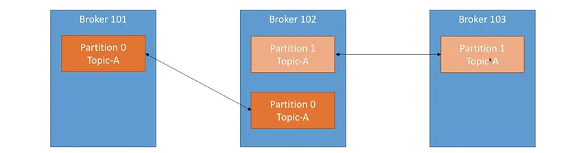

# KAFKA:

Database throughput is very low (i.e no of reads/writes for that database, it cannot handle many requests in one sec)
Example with these applications like Zomato, Discord, Uber.
- In Zomato, we need to update the delivery status everysec(how much time it takes to deliver the food). So, If it is implemented in normal process, by fetching the driver input and saving them to database and do some analytic stuff and then share it to customer, then it will be very slow and not a real time.
- In Discord, for example if there are 67,000 users are using it, then it has to handle large number of messages per sec i.e it needs to store and then reflect that in other customer chat, By all these it will be not a real time and database will be down. as we know the throughput of database is low.

*Kafka has high throughput, storage is low, no query.* \
*Database has low throughput, storage is high, no query.* \
So, we need to use both, but not as subtitute to other.

Kafka is a distributed streaming platform for building data real time pipelines and streaming applications.
It is created to solve ingesting *high volumes of event data with low latency.*

In Kafka we have topics, partition and offsets.

### Topic: 
It represents a particular stream of data. (similar to table in database without constraints). Identified by its unique name. \
For ex: In Zomato, we will have different topics like one topic for Rider updates, other topic --> hotel updates. For partitions, if we take riders topic, in that North India is one partition and other for South India.
- In Topics, we have multiple partitions.
- Each partition will have stream of data in it in **ORDERED**.
- Each message within a partition gets an incremental id, called **OFFSET**.
- Each partition is independent, with its own speed.
- msg has its coordinates with topic name, partition id and its offset.
- data is kept for only limited amount of time.
- Kafka is immutable, if we write a message number 3 in partition 0, then we cannot overwrite the data.
- If we dont provide a key to message then when we send message to kafka topic then data is assigned to random partition.

- It serves as higly reliable msg queue. It decouples data producers and consumers. So, they can operate independently.
#### Usecases:
- Activity tracking like events --> clicks, views and purchases.
Ex: Uber, Netflix uses to track user activity.
- Kafka can consolidate disparate streams into unified real-time pipelines for analytics and storage. 
- In microservices architecture, it serves as a real time data-bus that allows different services to communicate.
- It enables scalable stream processing big-data thourgh its distributed architecture. It can handle massive volume. Ex: Processing user click streams for product recommendations or analyzing financial market data.

### Limitations:
- It is quite complicated and has steep learning curve.
- May not be ideal for smaller startups
- not suitable for ultra low latency applications like high freq trading where micro sec matter. (other alternatives like RabbitMQ, Custom TCP/UDP Solutions.)

### Kafka brokers:
Kafka is distributed data infrastructure, which implies that there is some kind of node that can be duplicated across a network such that the collection of all of those nodes functions together as a single Kafka cluster. That node is called a broker.

- Brokers are machines on which apache Kafka is running and providing its services both to producers and consumers. 
- The system can have multiple brokers (and that is recommended for high availability and fault tolerance) and each broker can be identified by id.
- An computer, instance or container running on kafka process.
- Manage partitions, handle incoming requests write and read requests.
- Manage replication of partitiond 
- Intentionally kept very simple.
- If the client connects to any broker (called a bootstrap broker), the client will be connected to the entire cluster.

## Producers:
Producer writes data to a topic (which is made of partitions)
Producers automatically know which broker and partition to write to.
In case of broker failure producers will automatically recover.

Eg: Let’s say we have a producer, and it is sending data to partition one and two of Topic-A . basically by sending data to Kafka to the topic, producers will load balance , automatically send a little bit to broker one, little bit to broker 2, little bit to broker 3 and then switch on again. This is how load balancing is done in Kafka.

Producers can choose to receive acknowledgement of data writes. There are three acknowledgement modes:

1. Acks =0 : Producers sends data and will wait for acknowledgement. (possible data loss because if a producer sends data to broker and broker down then there is no ack, so we dont know about it).

2. Acks = 1 : default mode, producer will wait for leader acknowledgement.
(data loss limited)

3. Acks = all: leader and all the replicas acknowledgement(no data loss)

### --> Message Keys:
- producers can choose the keys to send along woth messages.
- when there is no key and sent the message, then key will be null and data will be send in round robin technique i.e 1st msg will be for one partition and 2nd msg for other partition etc.
- But with Key, all the related msgs will be send to one partition.
- We cannot specify this key goes to this partition but all msgs with this key goes to same partition.

## Consumers:
Consumers read data from a topic and the topic is going to be identified by it’s name. Consumers automatically know which broker to read from. In case of broker failures, consumers know how to recover (just like producers). Data in overall will be read in order within each partition.

- when only one consumer comes, then all the partitions will be given to that consumer.
- when two consumers are there, then it will split the partitions to provide the data, i.e load balancing.

for example: topic --> 1
partition --> 4

If consumers --> 1, then all 4 partitions gives to one consumer. \
If consumers --> 2, then 2 will be for one consumer and other two will be for 2nd consumer. \
If consumers --> 3, then 2 partitions may be for one consumer and other two will be for 2nd and 3rd consumer(per one).
If we have more consumers than the partitions , few may be idle. Sometimes you may want that because for example let’s say that you are gonna lose consumer 3 like the application just stops or the machine shuts down. Then consumer 4 can take over right away. 

### Consumer Groups:

One consumer can consume mutliple partions.
one partition cannot be consumed by multiple consumers.

If we have one kafka and one topic and few partitions. if we create a consumer in consumer group by default it will be in consumer group not individually.

In one group, one partition cannot be consumed by more than one consumer.
In group level , one partition can be consumed by more than one consumer group.

Queue: one producer and one consumer. \
Pub/sub: one producer and multiple consumers. 

Kafka works like queue with pub/sub model. \
- If no of partitions == no of consumers, then it will work like queue
- If not, then it will work like pub/sub

Zoo keeper works for load balancing.

**Topic Replication factor:**

In a distributed system like Kafka, replication is essential for fault tolerance. When creating a topic, you specify a replication factor, typically between 2 and 3. This factor determines the number of copies (replicas) of each partition of the topic. For example, if Topic-A has a replication factor of 2, partitions are replicated on multiple brokers (e.g., on Broker 102 and Broker 103). In case a broker goes down, other brokers with replicas can still serve the data. This ensures data availability and prevents loss in the event of a machine failure. For instance, if Broker 2 fails, data can still be served by Broker 101 and Broker 103, thanks to the replication factor.

each partition of a topic has a leader and in-sync replicas (ISR). For example, in partition 0, Broker 101 is the leader, and Broker 102 is an ISR. In partition 102, Broker 102 is the leader, and Broker 103 is an ISR. Zookeeper determines leaders and ISRs. If Broker 101 is lost, partition 0 on Broker 102 becomes the leader since it was an in-sync replica. When Broker 101 returns, it replicates data and attempts to become the leader again. This process is managed automatically by Kafka in the background.

### Delivery semantics for consumers:
Consumers choose when to commit offsets. There are 3 delivery semantics.

1. **At Most Once:**
   - Offsets are committed as soon as the message is received.
   - If processing fails, the message is lost and won't be read again.
   - Generally not preferred for scenarios where data loss is unacceptable.

2. **At Least Once:**
   - Offsets are committed after the message is processed.
   - If processing fails, the message will be read again, potentially leading to duplicate processing.
   - Preferred for most scenarios; requires ensuring that the processing is idempotent to handle duplicates.

3. **Exactly Once:**
   - Achievable for Kafka => Kafka workflows using Kafka Streams API.
   - Critical for scenarios like Kafka => Database to avoid duplicates in the database.
   - Involves using an idempotent consumer to ensure no duplicates in the final system.
   - Requires careful consideration and often involves specific tools or approaches, depending on the use case.

4. **Idempotent Consumer:**
   - Ensures that processing a message multiple times does not impact the system.
   - Crucial for achieving Exactly Once semantics, especially when writing data to external systems like databases.

- When data flows from Kafka to external systems, achieving Exactly Once semantics is important to prevent duplicates in the final database.
- Use idempotent consumers to handle this effectively.

### Kafka Broker Discovery:

In a Kafka cluster, every broker serves as a bootstrap server, simplifying the client's connection process. When a Kafka client (producer or consumer) establishes a connection, it can connect to any broker in the cluster. Through a metadata request, the chosen broker provides the client with essential information, including the list of all brokers and their IPs. This metadata enables the client to understand the Kafka cluster's structure, topics, and partitions. Subsequently, the client can dynamically determine which broker to connect to for producing or consuming data. This automated process of broker discovery ensures that connecting to just one broker is sufficient for the client to access the entire Kafka cluster, regardless of its size (even with hundreds of brokers).

## Zookeeper
Zookeeper is what holds the brokers together. Zookeeper manages the brokers, it keeps a list of them and zookeeper will also help in performing leader elections for partitions. When a broker goes down, there is a new partition that becomes a leader and zookeeper helps with that. Zookeeper also will send notifications to Kafka in case there is any changes. Eg: New topic, broker dies, broker comes up, delete topics, etc. Kafka can not work without Zookeeper. When you stark Kafka, you first have to start Zookeeper. Zookeeper by design operates with an odd number of servers (3,5,7). Zookeeper has a leader and the leader handles the writes from the brokers. Rest of the servers are followers and they handle reads. (The producers and consumers don’t write to the zookeeper. They write to Kafka and Kafka manages all metadata in zookeeper.)

References:
1. https://medium.com/@rajithaf/theory-behind-kafka-30d21b64a9de#:~:text=Kafka%20Guarantees%20that%2C,3%20is%20a%20good%20idea.

2. https://www.youtube.com/watch?v=ZJJHm_bd9Zo&ab_channel=PiyushGarg

3. https://on.notist.cloud/pdf/deck-6404984a22409b84.pdf

4. https://kafka.js.org/docs/admin

docker run -p 9092:9092 -e KAFKA_ZOOKEEPER_CONNECT=192.168.56.1:2181 -e KAFKA_ADVERTISED_LISTENERS=PLAINTEXT://192.168.56.1:9092 -e KAFKA_OFFSETS_TOPIC_REPLICATION_FACTOR=1 confluentinc/cp-kafka

