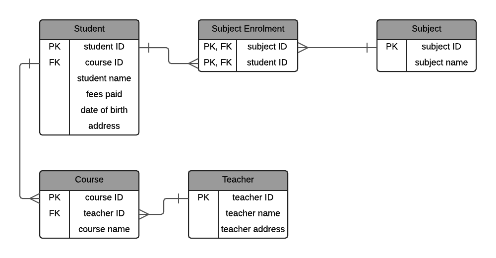
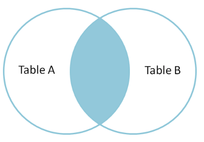

## Database:
There are several types of databases, depending on how data is stored, retrieved, and modified. But there are two major types, which are relational and non-relational databases.

Relational Database---> known as SQL database, used to store at ain tables i.e in rows and columns.

- Its understand how different data structures relate to one another.
- To access data from relational databases, you will use SQL (Structured Query Language). few are MySQL, PostgreSQL, MSSQL, and Oracle.

Non-relational database --> known as NoSQL Databases, that store data in a non-tabular format.
- It has a variety of different storage methods, such as document, key-value, graph, wide-column, and more

- MongoDB, Amazon DynamoDB, Redis, Cassandra, ElasticSearch and lots more.

# SQL:

- CREATE TABLE employees (id INTEGER, name TEXT, age INTEGER, is_manager BOOLEAN, salary INTEGER);

ALTER TABLE - ALTER/MODIFY DATATYPE

- ADD COLUMN `ALTER TABLE table_name
ADD column_name datatype;`

- DROP COLUMN `ALTER TABLE table_name
DROP COLUMN column_name;`

- RENAME COLUMN
`ALTER TABLE table_name
RENAME COLUMN old_name to new_name;`

- ALTER/MODIFY DATATYPE 
`ALTER TABLE table_name
ALTER COLUMN column_name datatype;`

### Constraints:
 - rules we create on db that enforces specific behaviour
 
 - **NOT NULL** 
 - **Primary Key**
 - **Foreign Key** - defines the relationships between tables

```SQL
CREATE TABLE Customers (
    CustomerID INT PRIMARY KEY,
    CustomerName VARCHAR(255) NOT NULL,
    Email VARCHAR(255) NOT NULL
);

CREATE TABLE Orders (
    OrderID INT PRIMARY KEY,
    OrderDate DATE NOT NULL,
    CustomerID INT,
    -- Foreign key constraint referencing the Customers table
    FOREIGN KEY (CustomerID) REFERENCES Customers(CustomerID)
);
```

### WHERE vs HAVING:
- A WHERE condition is applied to all the data in a query before it's grouped by a GROUP BY clause.
- A HAVING condition is only applied to the grouped rows that are returned after a GROUP BY is applied.


## Database normalization:

1. Improve data integrity -- acccuracy and consistency of data. Ex: Age is stored in DB instead of DOB then it wont be correct as time passes.
2. Reduce data redundancy: duplicates in mutiple places. 
    Disadvantage: when updated no longer consistent across all the copies of data.

Database:
| Student Name   | Fees Paid | Date of Birth | Address                        | Subject 1              | Subject 2                 | Subject 3              | Subject 4               | Teacher Name        | Teacher Address            | Course Name     |
|-----------------|------------|----------------|--------------------------------|------------------------|---------------------------|------------------------|-------------------------|---------------------|----------------------------|-----------------|
| John Smith      | 18-Jul-00  | 04-Aug-91      | 3 Main Street, North Boston 56125 | Economics 1 (Business) | Biology 1 (Science)      |                        |                         | James Peterson      | 44 March Way, Glebe 56100 | Economics        |
| Maria Griffin   | 14-May-01  | 10-Sep-92      | 16 Leeds Road, South Boston 56128 | Biology 1 (Science)    | Business Intro (Business)| Programming 2 (IT)    |                         | James Peterson      | 44 March Way, Glebe 56100 | Computer Science |
| Susan Johnson   | 03-Feb-01  | 13-Jan-91      | 21 Arrow Street, South Boston 56128| Biology 2 (Science)    |                           |                        |                         | Sarah Francis       |                           | Medicine         |
| Matt Long       | 29-Apr-02  | 25-Apr-92      | 14 Milk Lane, South Boston 56128  |                        |                           |                        |                         | Shane Cobson        | 105 Mist Road, Faulkner 56410 | Dentistry        |


### **1 NF**:

Needs to follow 2 rules,

1. Does the combination of all columns make a unique row every single time? (each row unique)
2. What field can be used to uniquely identify the row? (primary key)

Now, to answer this questions, we need to clear and split the above data i.e in single table.

- 1.point, In the above table, There could be the same combination of data, and it would represent a different row. 
- 2.point, Is this the student name? No, as there could be two students with the same name. Address? No, this isn’t unique either. Any other field?
We don’t have a field that can uniquely identify the row.

> *If there is no unique field, we need to create a new field. This is called a primary key, and is a database term for a field that is unique to a single row.*

So, our new table is:
```
Student (student ID, student name, fees paid, date of birth, address, subject 1, subject 2, subject 3, subject 4, teacher name, teacher address, course name)
```

### **2 NF**: 
Rule of the 2NF is, 
1. Fulfil the requirements of first normal form
2. Each non-key attribute must be functionally dependent on the primary key

**Functional dependency** means that each non-key field (attributes not part of the primary key) is uniquely determined by the primary key. i.e *All columns that are not part of the primary key are dependent on the entire primary key, and not just one of the columns in the primary key.*

If we see above example, the primary key is student ID, which represents the student. Let’s look at each column:
- student name: Yes, this is dependent on the primary key. 
- fees paid: Yes, this is dependent on the primary key. Each fees paid -value is for a single student.
- date of birth: Yes, it’s specific to that student.
- address: Yes, it’s specific to that student.
- subject 1: No, this column is not dependent on the student. More than one - student can be enrolled in one subject.
- subject 2, subject 3, subject 4: As above, more than one subject is allowed.
- teacher name: No, the teacher name is not dependent on the student.
- teacher address: No, the teacher address is not dependent on the student.
- course name: No, the course name is not dependent on the student.

First, the subject 1,2,3,4 columns are not dependent on the student, as more than one student can have a subject, and the subject isn’t a part of the definition of a student.

So, create a new table for Subject. `Subject (subject ID, subject name)`

Similarly, `Teacher (teacher ID, teacher name, address)`, 
`Course (course ID, course name)`

*Foreign Keys in Tables:*
As we have 4 different tables, we need a mapping/ link b/w them.

Let’s start with students taking courses. For our example scenario, a student can only be enrolled in one course at a time, and a course can have many students.

We need to either:

- Add the course ID from the course table into the student table 
- Add the student ID from the student table into the course table

But which one is it? we will chose one according to this, 

*"Does a table1 have many table2s, or does a table2 have many table1s?"*
- If it’s the first, then table1 ID goes into table 2, and if it’s the second then table2 ID goes into table1.

Certainly! Here's the explanation in Markdown format:

**Table1 and Table2 Relationship:**
- If Table1 has many instances of Table2, place the primary key of Table1 (Table1 ID) as a foreign key in Table2.
- If Table2 has many instances of Table1, place the primary key of Table2 (Table2 ID) as a foreign key in Table1.

**Applying the Rule to Course and Student:**
- Does a course have many students, or does a student have many courses?
- If a course has many students (which is true in most educational scenarios), then the course ID goes into the student table.

Student(student ID,	course ID, student name, fees paid, date of birth, address)

What about the subject table?
Does a subject have many students, or does a student have many subjects?
The answer is both.

**Many to Many Relationships**:

If we can’t represent this relationship by putting a foreign key in each table, how can we represent it? ---> *by using a joining table*.

*Handling Many-to-Many Relationships:*
- To represent this complex relationship, a joining table is introduced.
- In the context of subjects and students, a joining table containing columns for student ID and subject ID.

Subject_Student (student ID, subject ID)

So, our final table structure looks like this:
```
Student (student ID, course ID, student name, fees paid, date of birth, address)
Subject (subject ID, subject name)
Subject Enrolment (student ID, subject ID) // join table 
Teacher (teacher ID, teacher name, teacher address)
Course (course ID, teacher ID, course name)
```
<!--  -->



### **3 NF**: 
3 nf is the final stage of the most common normalization process. The rule for this is:
- Fulfils the requirements of second normal form
- Has no transitive functional dependency

**transitive functional dependency**: every attribute that is not the primary key must depend on the primary key and the primary key only. \
for Ex: \
Column A determines column B \
Column B determines column C \
Therefore, column A determines C.  This is a transitive functional dependency, and it should be removed. Column C should be in a separate table.

*Notice that this is only slightly different from second normal form. In second normal form we can't have a column completely dependent on a part of the primary key, and in third normal form we can't have a column that is entirely dependent on anything that isn't the entire primary key.*

- In this table, `Student (student ID, course ID, student name, fees paid, date of birth, address)`
every column looks good except the address, as it constist of similar format, *3 Main Street, North Boston 56125*.

- zipcode can say about the state and city. so city and state are depends on zip which is not a primary key.

So, how can we improve this?

- We can move the ZIP code to another table, along with everything it identifies, and link to it from the student table.

Our table could look like this:

`Student (student ID, course ID, student name, fees paid, date of birth, street address, address code ID)`,\
`Address Code (address code ID, ZIP code, suburb, city, state)`


So final look:
```
Student (student ID, course ID, student name, fees paid, date of birth, street address, address code ID)

Address Code (address code ID, ZIP code, suburb, city, state)

Subject (subject ID, subject name)

Subject Enrolment (student ID, subject ID)

Teacher (teacher ID, teacher name, street address, address code ID)

Course (course ID, teacher ID, course name)
```

**Functional Dependency:** prime attribute (depands on)---> non - prime attribute \
**Partial Dependency:** part of prime key ---> non - prime attribute \
**Transitive Dependency:** non - prime attribute ---> non - prime attribute \
non - prime attribute --->  prime attribute  ===> **not possible in BCNF**

### **BCNF**:

For a table to satisfy the Boyce-Codd Normal Form, it should satisfy the following two conditions:

- It should be in the Third Normal Form.
- And, for any dependency A → B, A should be a super key.

In simple words, it means, that for a dependency A → B, A cannot be a non-prime attribute, if B is a prime attribute.


### **4 NF**:

- It should be in the Boyce-Codd Normal Form.
- The table should not have any Multi-valued Dependency.
    - For a dependency A → B, if for a single value of A, multiple value of B exists, then the table may have multi-valued dependency.
    - Also, a table should have at-least 3 columns for it to have a multi-valued dependency.
    - And, for a relation R(A,B,C), if there is a multi-valued dependency between, A and B, then B and C should be independent of each other

| s_id | course | hobby  |
|------|--------|--------|
| 1    | Science| Cricket|
| 1    | Maths  | Hockey |
| 1    | Science| Hockey |
| 1    | Maths  | Cricket|

And, in the table above, there is no relationship between the columns course and hobby. They are independent of each other.

*So there is multi-value dependency, which leads to un-necessary repetition of data and other anomalies as well.*

To make the above relation satify the 4th normal form, we can decompose the table into 2 tables.

**CourseOpted Table:**
| s_id | course  |
|------|---------|
| 1    | Science |
| 1    | Maths   |
| 2    | C#      |
| 2    | Php     |

**Hobbies Table:**
| s_id | hobby   |
|------|---------|
| 1    | Cricket |
| 1    | Hockey  |
| 2    | Cricket |
| 2    | Hockey  |

### **5NF**:
The fifth normal form is also called the PJNF - Project-Join Normal Form. It is the most advanced level of Database Normalization. Using Fifth Normal Form you can fix Join dependency and reduce data redundancy.

- A relation is in 5NF if it is in 4NF and not contains any join dependency and joining should be lossless.
- 5NF is satisfied when all the tables are broken into as many tables as possible in order to avoid redundancy, In other words, it cannot be decomposed into any number of smaller tables without loss of data.

## Joins:
**INNER JOIN:**  By default, a JOIN command is an INNER JOIN. An INNER JOIN returns all of the records in table_a that have matching records in table_b.

**ON:**
In order to perform a join, we need to tell the database which fields should be "matched up". The ON clause is used to specify these columns to join.

<div>



</div>

**LEFT JOIN:**  A LEFT JOIN will return every record from table_a regardless of whether or not any of those records have a match in table_b. A left join will also return any matching records from table_b.

**RIGHT JOIN**:
 as you may expect, the opposite of a LEFT JOIN. It returns all records from table_b regardless of matches, and all matching records between the two tables.

**FULL JOIN** : it combines the result set of the LEFT JOIN and RIGHT JOIN commands. It returns all records from both from table_a and table_b regardless of whether or not they have matches.


## Database Performance:

**Indexes**:  an in-memory structure that ensures that queries we run on a database are performant,i.e they run quickly.

- PRIMARY KEY columns are indexed by default, ensuring you can look up a row by its id very quickly. But if you have other columns that you want to be able to do quick lookups on, you'll need to index them.

**Multi-column index** is sorted by the first column first, the second column next, and so forth. A lookup on only the first column in a multi-column index gets almost all of the performance improvements that it would get from its own single-column index. But lookups on only the second or third column will have very degraded performance.

- In this, the sorting order is crucial for query performance. Lookups on the first column benefit from significant performance improvements, similar to a single-column index. However, queries based on later columns in the index may experience degraded performance since the index is primarily sorted by the first column. Choosing the right order of columns in a multi-column index depends on optimizing queries involving the specific columns in your application.

- Unless you have specific reasons to do something special, only add multi-column indexes if you're doing frequent lookups on a specific combination of columns.

`CREATE INDEX first_name_last_name_age_idx
ON users (first_name, last_name, age);`

Denormalizing for speed ---> i.e data integrity and deduplication come at a cost, and that cost is usually speed.

`CREATE INDEX index_name on table_name (column_name);`

-  an index is a data structure that can perform quick lookups. By indexing a column, we create a new in-memory structure, usually a binary-tree, where the values in the indexed column are sorted into the tree to keep lookups fast. So in terms of time complexity, a binary tree index ensures that lookups are O(log(n)).

## SQL Injection:
SQL is a very common way hackers attempt to cause damage or breach a database.


Example:  `INSERT INTO students(name) VALUES (?);`

and the "name" of a student was 'Robert'); DROP TABLE students;-- then the resulting SQL query would look like this:

`INSERT INTO students(name) VALUES ('Robert'); DROP TABLE students;--)`

So this is actually 2 queries! The first one inserts "Robert" into the database, and the second one deletes the students table!

**protect against SQL injection**
- these days is to simply use a modern SQL library that sanitizes SQL inputs. We don't often need to sanitize inputs by hand at the application level anymore.

## CRUD Operations in SQL:

CRUD --> Create, Read, Update and Delete

Similar to HTTP methods, HTTP POST - CREATE
HTTP GET - READ
HTTP PUT - UPDATE
HTTP DELETE - DELETE

 *Created a seperate file for this.*